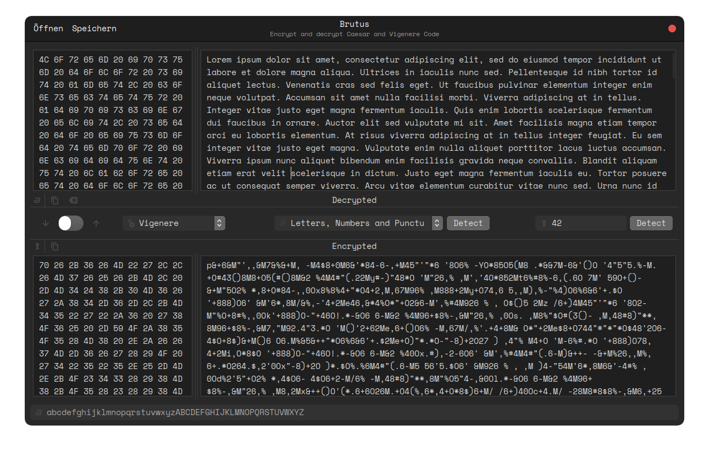

# Brutus Encryptor
> Projekt für HS-RT Info 1 (benotet)



## Aufgabenstellung / Assignment
> **Historische Chiffren und wie man sie brechen kann** \
Entwickeln Sie ein Programm, das es Ihnen erlaubt einen Text mit einem historischen Chiffrier-
algorithmus zu verschlüsseln bzw. einen verschlüsselten Text zu entschlüsseln. Beginnen Sie z.B. mit
dem Caesar-Chiffre. Entwickeln Sie nun ein zweites Programm, das versucht einen verschlüsselten
Text zu entschlüsseln ohne das Geheimnis von Sender und Empfänger der Nachricht zu haben.
Erweitern Sie nun ihr Programm um Funktionen für den Vigenère-Chiffre (das Brechen dieses
Algorithmus ist schon gar nicht mehr trivial und kann weggelassen werden).
Mögliche Erweiterungen sind:
>> 1. Umsetzung weiterer Verschlüsselungsalgorithmen, z.B. die Enigma-Chiffre.
>> 2. Verbesserung des Codebrechen-Algorithmus, z.B. durch bessere statistische Verfahren.
>> 3. Visualisierung des Brechens eines Codes.
>>
> Ein mit der Vigenère-Chiffre verschlüsselter Text:
Psm Jzpw-Fdcbjqc spqxvfz nit Sopfuwvje vcfrdmo, iovo poz Uqhb ogb tbzq ofzeo jed! Qtf oz ag ucsl
nioz sau pka tqrz wuot torejqbqhqb.

> **Historic ciphers and how to break them** \
Develop a program that allows you to encrypt a text with a historical cipher
algorithm to encrypt or decrypt an encrypted text. Start e.g. with
the Caesar cipher. Now develop a second program that tries a cipher text to decrypt without the secret of sender and recipient of the message to have.
Now expand your program with functions for the Vigenère cipher (breaking this
Algorithm is no longer trivial and can be omitted).
Possible extensions are:
>> 1. Implementation of further encryption algorithms, e.g. the Enigma cipher.
>> 2. Improvement of the code breaking algorithm, e.g. by better statistical methods.
>> 3. Visualization of breaking a code.
>>
> A text encrypted with the Vigenère cipher:
Psm Jzpw-Fdcbjqc spqxvfz nit Sopfuwvje vcfrdmo, iovo poz Uqhb ogb tbzq ofzeo jed! Qtf oz ag ucsl
nioz sau pka tqrz wuot torejqbqhqb.

## Installation und Ausführung / Installation and Running

This program is written for Linus mainly, but should work on Windows and Mac as well with some minor changes. (you will have to have Gtk installed)

### Benötigte Pakete / Prerequisites:
- Python >=3.8
  - PyGObject
  - typing
  - functools
  - pyinstaller *(for building)*

### Zum Ausführen des Programms / To run the program:
```sh
git clone https://github.com/frederikbeimgraben/Info1-Projekt
cd Info1-Projekt
python src/main.py
```

Or download the latest release from [here](https://github.com/frederikbeimgraben/Brutus/releases) and run it.
This will require you to have PyGObject installed.

### Zur Installation des Programms / To install the program:
```sh
git clone https://github.com/frederikbeimgraben/Info1-Projekt
cd Info1-Projekt

make
sudo make install
```

## Andere enthaltene Dateien / Other included files:
- `src/encrypt_file.py` - Encrypts a file with the given cipher. \
  For usage run `python src/encrypt_file.py --help`.

## Fortschritt / Progress
- [x] Caesar Chiffre / Caesar Cipher
- [x] Vigenère Chiffre / Vigenère Cipher
- [x] Basis UI / Basic UI
- [ ] Enigma Chiffre / Enigma Cipher
- [ ] AES Chiffre / AES Cipher
- [ ] Es wird noch mehr / There´s more to come